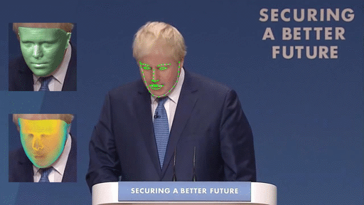
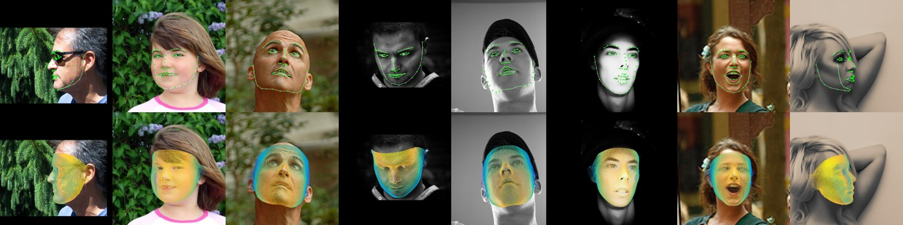
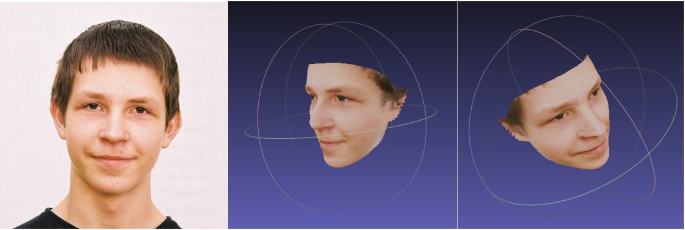
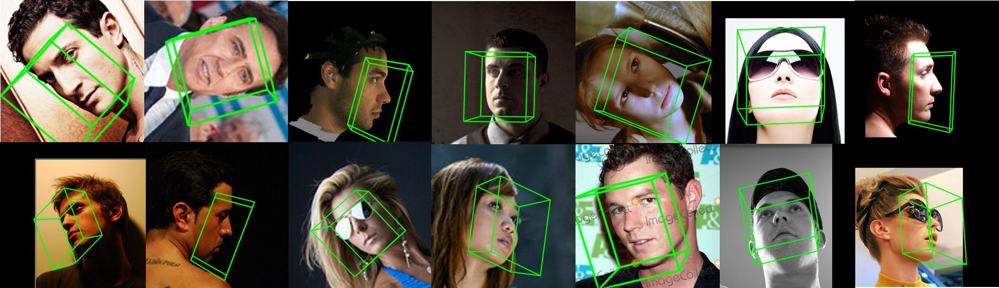
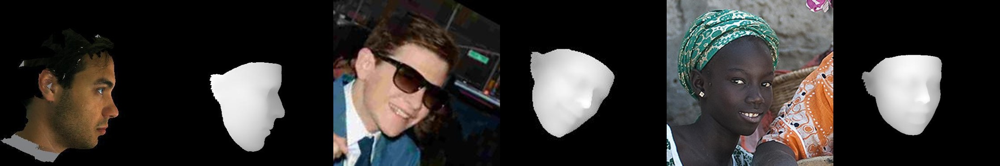
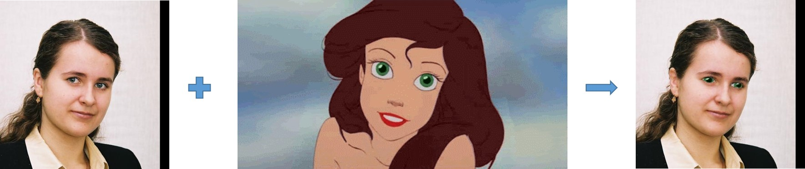
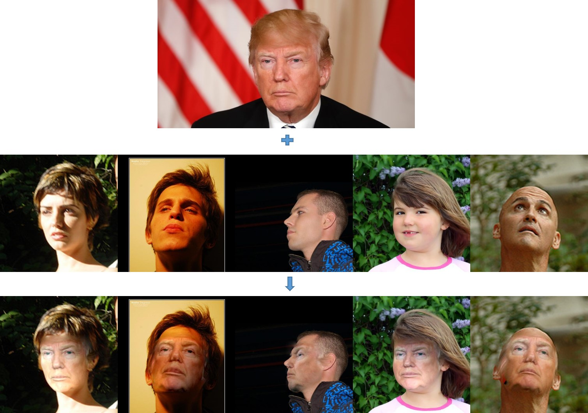

# Joint 3D Face Reconstruction and Dense Alignment with Position Map Regression Network

<p align="center"> 

</p>


This is an official python implementation of PRN. 

PRN is a method to jointly regress dense alignment and 3D face shape in an end-to-end manner. More examples on Multi-PIE and 300VW can be seen in [YouTube](https://youtu.be/tXTgLSyIha8) .

The main features are:

* **End-to-End**  our method can directly regress the 3D facial structure and dense alignment from a single image bypassing 3DMM fitting.

* **Multi-task**  By regressing position map, the 3D geometry along with semantic meaning can be obtained. Thus, we can effortlessly complete the tasks of dense alignment, monocular 3D face reconstruction, pose estimation, etc.

* **Faster than real-time**  The method can run at over 100fps(with GTX 1080) to regress a position map.

* **Robust** Tested on facial images in unconstrained conditions.  Our method is robust to poses, illuminations and occlusions. 

  

## Applications

### Basics(Evaluated in paper)

* #### Face Alignment

Dense alignment of both visible and non-visible points(including 68 key points). 

And the **visibility** of  points(1 for visible and 0 for non-visible).



* #### 3D Face Reconstruction

Get the 3D vertices and corresponding colours from a single image.  Save the result as mesh data(.obj), which can be opened with [Meshlab](http://www.meshlab.net/) or Microsoft [3D Builder](https://developer.microsoft.com/en-us/windows/hardware/3d-print/3d-builder-resources). Notice that, the texture of non-visible area is distorted due to self-occlusion.

**New**: 

1. you can choose to output mesh with its original pose(default) or with front view(which means all output meshes are aligned)
2. obj file can now also written with texture map(with specified texture size), and you can set non-visible texture to 0. 





### More(To be added)

* #### 3D Pose Estimation

  Rather than only use 68 key points to calculate the camera matrix(easily effected by expression and poses), we use all vertices(more than 40K) to calculate a more accurate pose.

  #### 

* #### Depth image

  

* #### Texture Editing

  * Data Augmentation/Selfie Editing

    modify special parts of input face, eyes for example:

    

  * Face Swapping

    replace the texture with another, then warp it to original pose and use Poisson editing to blend images.

    

    


## Getting Started

### Prerequisite

* Python 2.7 (numpy, skimage, scipy)

* TensorFlow >= 1.4

  Optional:

* dlib (for detecting face.  You do not have to install if you can provide bounding box information. )

* opencv2 (for showing results)

GPU is highly recommended. The run time is ~0.01s with GPU(GeForce GTX 1080) and ~0.2s with CPU(Intel(R) Xeon(R) CPU E5-2640 v4 @ 2.40GHz).

### Usage

1. Clone the repository

```bash
git clone https://github.com/YadiraF/PRNet
cd PRNet
```

2. Download the PRN trained model at [BaiduDrive](https://pan.baidu.com/s/10vuV7m00OHLcsihaC-Adsw) or [GoogleDrive](https://drive.google.com/file/d/1UoE-XuW1SDLUjZmJPkIZ1MLxvQFgmTFH/view?usp=sharing), and put it into `Data/net-data`

3. Run the test code.(test AFLW2000 images)

   `python run_basics.py #Can run only with python and tensorflow`

4. Run with your own images

   `python demo.py -i <inputDir> -o <outputDir> --isDlib True  `

   run `python demo.py --help` for more details.

5. For Texture Editing Apps:

   `python demo_texture.py -i image_path_1 -r image_path_2 -o output_path   `

   run `python demo_texture.py --help` for more details.


## Training

The core idea of the paper is:

Using position map to represent face geometry&alignment information, then learning this with an Encoder-Decoder Network.

So, the training steps:

1. generate position map ground truth.

   the example of generating position map of 300W_LP dataset can be seen in [generate_posmap_300WLP](https://github.com/YadiraF/face3d/blob/master/examples/8_generate_posmap_300WLP.py)

2. an encoder-decoder network to learn mapping from rgb image to position map.

   the weight mask can be found in the folder `Data/uv-data`

What you can custom:

1. the UV space of position map.

   you can change the parameterization method, or change the resolution of UV space.

2. the backbone of encoder-decoder network

   this demo uses residual blocks. VGG, mobile-net are also ok.

3. the weight mask

   you can change the weight to focus more on which part your project need more.

4. the training data

   if you have scanned 3d face, it's better to train PRN with your own data. Before that, you may need use ICP to align your face meshes.


## Q&A

1. How to **speed up**?

   a. network inference part

   you can train a smaller network or use a smaller position map as input.

   b. render part

   you can refer to  [c++ version](https://github.com/YadiraF/face3d/blob/master/face3d/mesh_cython/render.py). 

   c. other parts like detecting face, writing obj

   the best way is to rewrite them in c++.

2. How to improve the **precision**?

   a. geometry precision.

   Due to the restriction of training data, the precision of reconstructed face from this demo has little detail. You can train the network with your own detailed data or do post-processing like shape-from-shading to add details.

   b. texture precision.

   I just added an option to specify the texture size. When the texture size > face size in original image, and render new facial image with [texture mapping](https://github.com/YadiraF/face3d/blob/04869dcee1455d1fa5b157f165a6878c550cf695/face3d/mesh/render.py#L217), there will be little resample error.

   

## Changelog

* 2018/7/19 add training part. can specify the resolution of the texture map.
* 2018/5/10 add texture editing examples(for data augmentation, face swapping)
* 2018/4/28 add visibility of vertices, output obj file with texture map, depth image
* 2018/4/26 can output mesh with front view
* 2018/3/28 add pose estimation
* 2018/3/12  first release(3d reconstruction and dense alignment)


## License

Code: under MIT license.

Trained model file: please see [issue 28](https://github.com/YadiraF/PRNet/issues/28), thank [Kyle McDonald](https://github.com/kylemcdonald) for his answer.


## Contacts

Please contact _fengyao@sjtu.edu.cn_  or open an issue for any questions or suggestions(like, push me to add more applications).

Thanks! (●'◡'●)


## Acknowledgements

- Thanks [BFM team](https://faces.dmi.unibas.ch/bfm/), [Xiangyu Zhu](http://www.cbsr.ia.ac.cn/users/xiangyuzhu/projects/3DDFA/main.htm), and [Anil Bas](https://github.com/anilbas/3DMMasSTN) for sharing 3D data.
- Thanks Patrik Huber for sharing his work  [eos](https://github.com/patrikhuber/eos), which helps me a lot in studying 3D Face Reconstruction.
- Thanks the authors of  [3DMMasSTN](https://github.com/anilbas/3DMMasSTN), [DenseReg](https://github.com/ralpguler/DenseReg), [3dmm_cnn](https://github.com/anhttran/3dmm_cnn), [vrn](https://github.com/AaronJackson/vrn), [pix2vertex](https://github.com/matansel/pix2vertex), [face-alignment](https://github.com/1adrianb/face-alignment) for making their excellent works publicly available. 
